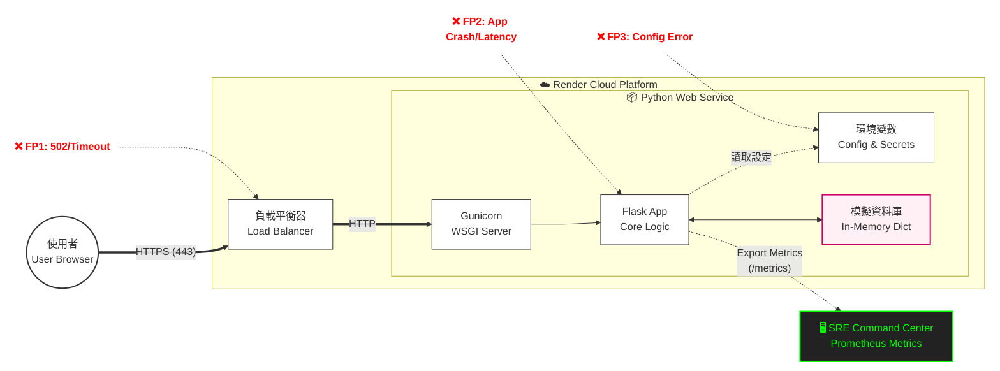

```mermaid
graph LR
    %% --- 樣式定義 (Design System) ---
    classDef user fill:#ffffff,stroke:#333,stroke-width:2px,color:#333;
    classDef platform fill:#f0f8ff,stroke:#0066cc,stroke-width:2px,stroke-dasharray: 5 5;
    classDef container fill:#e6fffa,stroke:#009999,stroke-width:2px;
    classDef component fill:#ffffff,stroke:#333,stroke-width:1px;
    classDef data fill:#fff0f5,stroke:#cc0066,stroke-width:2px;
    classDef monitor fill:#222,stroke:#0f0,stroke-width:2px,color:#0f0;
    classDef fail stroke:none,fill:none,color:#ff0000,font-weight:bold;

    %% --- 節點定義 ---
    User((使用者<br>User Browser)):::user
    
    subgraph Render_Cloud [☁️ Render Cloud Platform]
        direction TB
        LB[負載平衡器<br>Load Balancer]:::component
        
        subgraph Web_Service [📦 Python Web Service]
            Gunicorn[Gunicorn<br>WSGI Server]:::component
            Flask[Flask App<br>Core Logic]:::component
            Env[環境變數<br>Config & Secrets]:::component
            
            %% 模擬資料庫
            MemDB[模擬資料庫<br>In-Memory Dict]:::data
        end
    end
    
    %% SRE 監控中心
    Dashboard[🖥️ SRE Command Center<br>Prometheus Metrics]:::monitor

    %% --- 流量與關係 ---
    User == "HTTPS (443)" ==> LB
    LB == "HTTP" ==> Gunicorn
    Gunicorn --> Flask
    Flask <--> MemDB
    Flask -. "讀取設定" .-> Env
    
    %% 監控數據流
    Flask -. "Export Metrics\n(/metrics)" .-> Dashboard

    %% --- 故障點標記 (Failure Points) ---
    FP1(❌ FP1: 502/Timeout):::fail -.-> LB
    FP2(❌ FP2: App Crash/Latency):::fail -.-> Flask
    FP3(❌ FP3: Config Error):::fail -.-> Env

    %% --- 點擊互動 (可選) ---
    %% click Dashboard "https://your-render-url" "Open Dashboard"
```
